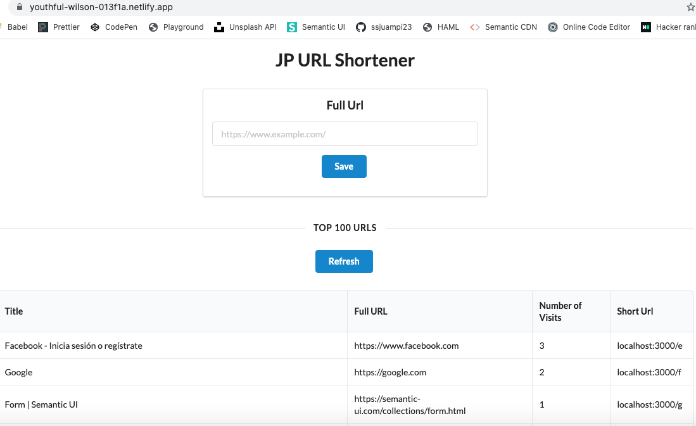
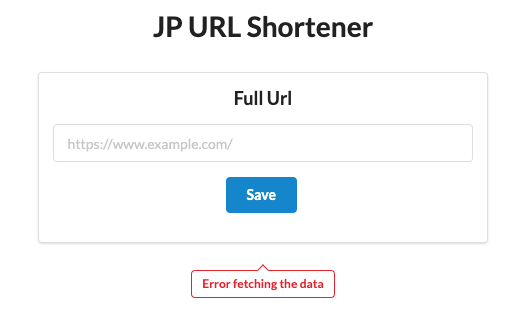
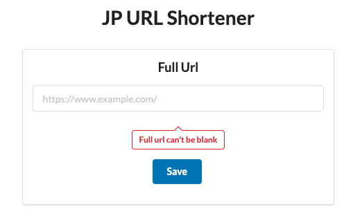
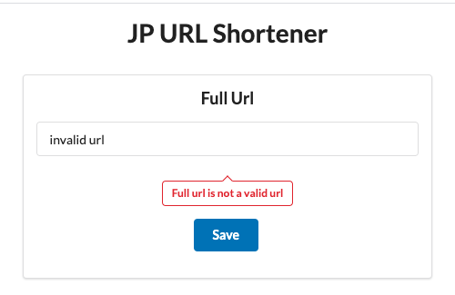
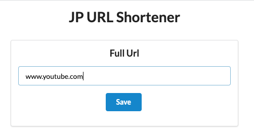
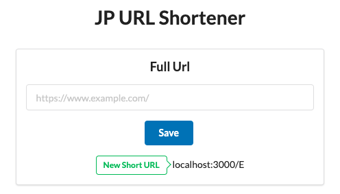
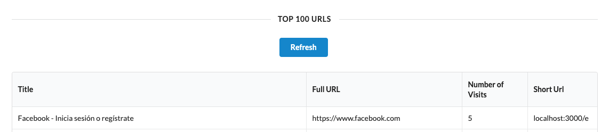
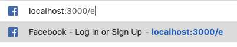
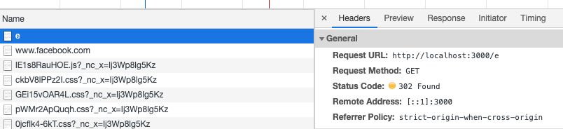
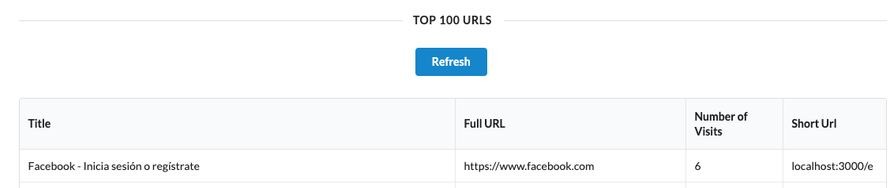

# JP Url Shortener Client Side App

This project was bootstrapped with [Create React App](https://github.com/facebook/create-react-app).

## Available Scripts

In the project directory, you can run:

### `yarn install`

This command will install all the project dependencies

### `PORT=3001 yarn start`

Runs the app in the development mode.\
Open [http://localhost:3001](http://localhost:3001) to view it in the browser.

The page will reload if you make edits.\
You will also see any lint errors in the console.

Port 3001 is to avoid collisions with the server app on Port 3000

## Shortener App Client 

The application has been deployed to [Netlify](https://youthful-wilson-013f1a.netlify.app/) to connect against the
server app running on port 3000. eg. [http://localhost:3000](http://localhost:3000)

## Default Page

The default page has the form to submit new URLs into the app and also the table displaying the Top 100 URLs

## Error Validations

No access to the api:

Invalid URLs:

Valid URLs:

## Click Count:

Before the user copies the link and performs the redirect:

Before the redirect happens:

In the middle of the redirect process:

After the user copies the link and performs the redirect:

